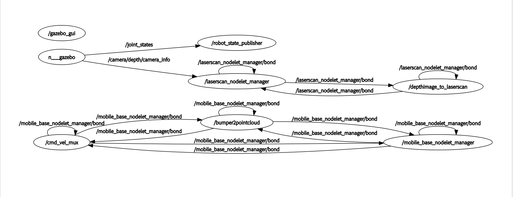
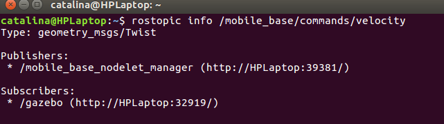
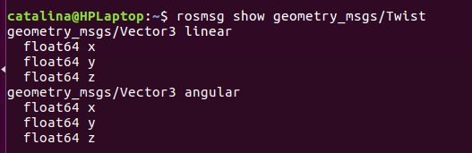

# 	 ROS基础介绍

## 1、ROS综述 

ROS，即Robot Operating System，是目前最广泛使用的开源机器人软件平台，极大的提升了机器人开发的效率。目前无人驾驶系统的实际实现仍然依赖于ROS，ROS虽然存在一些缺点，在无人驾驶系统的系统实现上，ROS仍然是开源框架中最好的选择。

### 1.1、ROS的历史

ROS系统是起源于2007年斯坦福大学人工智能实验室的STAIR项目与机器人技术公司Willow Garage的个人机器人项目（Personal Robots Program）之间的合作，2008年之后就由Willow Garage来进行推动。如今已被许多的学校公司所使用，为机器人变成提供了实际标准(Defacto standard)

### 1.2、ROS的特性

1、**点对点设计**：ROS的点对点设计以及服务和节点管理器等机制可以分散由计算机视觉和语音识别等功能带来的实时计算压力，能够适应多机器人遇到的挑战。
2、**分布式设计**：程序可以在多核计算机中运行，并且可以通过网络来通信。
3、**多语言**：ROS现在支持许多种不同的语言，例如C++、Python、Octave和LISP，也包含其他语言的多种接口实现。语言无关的消息处理，让多种语言可以自由的混合和匹配使用。
4、**轻量级**：鼓励将所有的驱动和算法逐渐发展成为和ROS没有依赖性单独的库。ROS建立的系统具有模块化的特点，各模块中的代码可以单独编译，而且编译使用的CMake工具使它很容易的就实现精简的理念。ROS基本将复杂的代码封装在库里，只是创建了一些小的应用程序为ROS显示库的功能，就允许了对简单的代码超越原型进行移植和重新使用。
5、**免费且开源**：ROS大多数的源代码都是公开发布的。

### 1.3、ROS中的概念

需要理解的ROS中的核心概念包括：

- master(主机)
- node（节点）
- topic（主题）和service（服务）
- message（消息）
- bag（包）

#### Master（主机）

用于管理节点间的通信，ROS Master 通过RPC（Remote Procedure Call Protocol，远程过程调用）提供了登记列表和对其他计算图表的查找。没有控制器，节点将无法找到其他节点，交换消息或调用服务。

开启Master命令：

roscore

#### Node（节点）

**节点就是一些独立编译，执行运算任务的进程**。ROS利用规模可增长的方式使代码模块化：一个系统就是典型的由很多节点组成的。在这里，节点也可以被称之为“软件模块”。我们使用“节点”使得基于ROS的系统在运行的时候更加形象化：当许多节点同时运行时，可以很方便的将端对端的通讯绘制成一个图表，在这个图表中，进程就是图中的节点，而端对端的连接关系就是其中弧线连接。

运行节点：

```bash
rosrun package_name node_name
```

查看激活节点列表：

```
rosnode list
```

检索有关节点的信息：

```
rosnode info node_name
```

#### Topic（主题）

在ROS中消息以一种发布/订阅的方式传递。一个节点可以在一个给定的主题中发布消息。一个节点针对某个主题关注与订阅特定类型的数据。可能同时有多个节点发布或者订阅同一个主题的消息。总体上，发布者和订阅者不了解彼此的存在。

查看激活主题：

```bash
rostopic list
```

订阅和打印一个主题的内容：

```
rostopic echo  /topic
```

显示主题相关信息：

```bash
rostopic info  /topic
```

#### Message（消息）

消息用来定义主题topic类型的数据结构，是整型，浮点型，布尔型，字符串等一系列结构进行压缩后，定义成*.msg文件。 
查看主题类型：

```bash
rostopic type /topic
```

向topic发布一个消息： 

```bash
rostopic pub /topic type args
```

服务是两个节点之间进行直接通信的方式。一个节点发出请求（request）后，另一个节点做出相应（response）。

包用于记录系统运行过程中产生的话题数据。

#### catkin 创建系统 

catkin是ROS构建系统，用来生成可执行文件，库和接口。 
(现在很多人建议用catkin build 来代替 catkin_make) 
首先进入工作区：

cd ~/catkin_ws
然后创建一个包：

```
catkin_create_pkg package_name depend1 depend2 depend3
```

每当你创建一个新包时，都需要更新你的环境：

source devel/setup.bash
在catkin创建的工作区中包含以下三个文件夹： 

1. src：这个就是用来存放源码的地方，操作者在这里面进行编码，修改 
2. build：用来存放缓存文件和一些中间文件 
3. devel：（development）存放创建目标的地方（在存放之前安装）

### 1.4、ROS中的项目组织

ROS的软件使用package（包）进行组织，包下通常包含一下内容：

> /src: 源代码
> /msg: 定义一些message
> /srv: 定义一些service
> /launch：包含用于启动节点的launch file
> /config：包含配置文件
> /test: Unit/ROS tests
> /include/package_name: C++ include头文件
> /doc：包含文档文件
> package.xml: package 信息
> CMakeLists.txt: CMake构建文件
> package.xml
> 这个文件定义了package的属性，这些属性包括：

#### package.xml

- package的名称
- 版本号
- 作者
- 协议
- 对其他package的依赖
……

```
<?xml version="1.0"?>
<package format="2">
  <name>ros_practice</name>
  <version>0.0.1</version>
  <description>The ros_practice package</description>

  <license>MIT</license>

  <buildtool_depend>catkin</buildtool_depend>
  <build_depend>roscpp</build_depend>
  <build_depend>sensor_msg</build_depend>
  <build_export_depend>roscpp</build_export_depend>
  <build_export_depend>sensor_msg</build_export_depend>
  <exec_depend>roscpp</exec_depend>
  <exec_depend>sensor_msg</exec_depend>
</package>
```

在这个例子中，我们使用了`roscpp`的client的库，同时我们使用了一个`sensor_msg`消息。

#### CMakeLists.txt

CMakeLists.txt文件是CMake构建系统的输入，在这里我们不会详细讨论CMake的写法（因为它本身可以很复杂），我们大致熟悉一下我们常用的CMake的语法：

cmake_minimum_required：需要的CMake的最低版本
project():包的名称
find_package() 查找建构是需要的其他 CMake/Catkin 包
add_message_files() add_service_files() add_action_files 生成Message/Service/Action
generate_messages() 调用消息生成
catkin_package() 指定包的构建信息
add_library()/add_executable()/target_link_libraries() 用于构建的库，可执行代码
install() 安装规则
下图是一个 CMakeLists.txt 的例子：


## 2、基于TurtleBot模拟器的实践

我们使用TurtleBot模拟器来实践ROS编程，TurtleBot本身是一种小型的轮式移动机器人（和我们关注的无人车比较相似），该模拟器基于Gazebo物理仿真环境，Gazebo是一款机器人仿真软件，基于ODE物理引擎，可以模拟机器人以及环境中的很多物理特性，TurtleBot模拟器的安装

```
sudo apt-get install ros-kinetic-turtlebot-*
```

使用roslaunch启动TurtleBot模拟器，启动一个空的世界：

```
roslaunch turtlebot_gazebo turtlebot_world.launch
```

roslaunch是ROS中启动多个节点的机制，Launch文件是ROS提供的可以同时运行多个nodes的文件。Launch文件以一种特殊的XML格式编写，以.launch结尾。

在运行了模拟器以后使用rqt_graph查看正在运行的节点和话题：



我们发现/gazebo节点订阅了一个/cmd_vel话题，使用rostopic info /husky_velocity_controller/cmd_vel 查看话题信息，得到如下信息：



```
Type: geometry_msgs/Twist

Publishers:
 * /twist_mux (http://adam:40181/)

Subscribers:
 * /gazebo (http://adam:35678/)
```

也就是说，这个控制指令是一个geometry_msgs/Twist消息，ROS中我们使用geometry_msgs/Twist消息类型来发布运动命令。控制命令会被基本的控制器节点使用。话题 /cmd_vel 全名 ” command velocities “ 。控制器节点订阅 /cmd_vel 话题，并将里面的运动命令(Twist 消息)通过 PID 控制算法转换成电机信号。使用

```
rosmsg show geometry_msgs/Twist
```

查看消息的格式：



```
geometry_msgs/Vector3 linear
  float64 x
  float64 y
  float64 z
geometry_msgs/Vector3 angular
  float64 x
  float64 y
  float64 z
```

其中，linear表示线速度（单位：m/s） ；angular表示角速度（单位：rad/s） 。

下面我们在指令行中通过向/mobile_base/commands/velocity 发送Twist消息来驱动我们的小车，我们让它以0.2m/s的速度和0.2rad/s的角速度运动：(**注意冒号与数字之间有空格**)

```bash
rostopic pub -r 10 /mobile_base/commands/velocity geometry_msgs/Twist '{linear:{x: 4, y: 0, z: 0}, angular:{x: 0, y: 0,z: 0.5}}'
```


其实我们还可以直接向/cmd_vel_mux/input/navi主题发消息来控制小车（不信的话可以试试rostopic info /cmd_vel_mux/input/navi看看订阅它的节点）:

```bash
rostopic pub -r 10  /cmd_vel_mux/input/navi geometry_msgs/Twist '{linear: {x: 4, y: 0, z: 0}, angular: {x: 0, y: 0, z: 0.5}}'
```

接下来我们使用键盘来控制turtlebot机器人，我们使用turtlebot包来实现对键盘数据转换为Twist指令并将Twist发布到/cmd_vel主题，启动turtlebot_teleop下的launch文件：

```
 roslaunch turtlebot_teleop keyboard_teleop.launch 
```

启动后会在终端打印如下的信息：

```
 PARAMETERS
 * /rosdistro: kinetic
 * /rosversion: 1.12.14
 * /turtlebot_teleop_keyboard/scale_angular: 1.5
 * /turtlebot_teleop_keyboard/scale_linear: 0.5

NODES
  /
    turtlebot_teleop_keyboard (turtlebot_teleop/turtlebot_teleop_key)

ROS_MASTER_URI=http://localhost:11311

process[turtlebot_teleop_keyboard-1]: started with pid [30248]

Control Your Turtlebot!
---------------------------
Moving around:
   u    i    o
   j    k    l
   m    ,    .

q/z : increase/decrease max speeds by 10%
w/x : increase/decrease only linear speed by 10%
e/c : increase/decrease only angular speed by 10%
space key, k : force stop
anything else : stop smoothly

```

下面的NODES表示启动了turtlebot_teleop_keyboard这个节点，它们位于turtlebot_teleop/turtlebot_teleop_key包中，上面是启动文件的参数信息，我们着重看一下三个参数：

```
* /turtlebot_teleop_keyboard/scale_angular: 1.5
* /turtlebot_teleop_keyboard/scale_linear: 0.5
```

前面两个分别表示控制速度和角速度的按键

Note: Husky作为一种轮式机器人，其能够控制的速度只有x方向的速度（前向）和z方向的角速度（Yaw，偏航角速度）

我们看一下此时的rqt_graph:


## 3、节点通信案例

节点A发布通过message消息发布a、b的值，节点B接受a,b的值并求和，节点C获取节点A发布的数值并打印，节点D接受B发布的求和值。