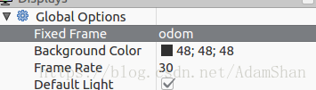
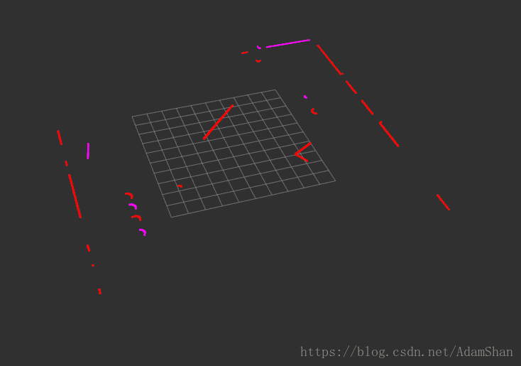

我们可以使用C++和Python语言来编写ROS程序，两种语言的ROS编程语法很相似，C++更贴近于无人车实践，所以我们从roscpp入手开始ROS编程学习。

#### ROS C++ Client库（roscpp）

下面是使用ros c++ 库编写的一个hello world程序：

```bash
#include <ros/ros.h>

int main(int argc, char** argv)
{
    ros::init(argc, argv, "hello_world");
    ros::NodeHandle nodeHandle;
    ros::Rate loopRate(10);
    unsigned int count = 0;
    while (ros::ok()) {
        ROS_INFO_STREAM("Hello World " << count);
        ros::spinOnce();
        loopRate.sleep();
        count++;
    }
    return 0;
}
```

看一下含义：

```
#include <ros/ros.h>
```

引入ros的头文件，

```bash
ros::init(argc, argv, "hello_world");
```

初始化ros，每个ros节点都应该最先调用这个方法，这个节点我们命名为hello_world;

```bash
ros::NodeHandle nodeHandle;
```

为这个进程的节点创建一个句柄。第一个创建的 NodeHandle 会为节点进行初始化，最后一个销毁的 NodeHandle 则会释放该节点所占用的所有资源。

```bash
ros::Rate loopRate(10);
```

ros::Rate是一个用于以指定的频率循环的辅助类，在这里我们循环的频率是10Hz

```bash
while(ros::ok()){...}
```

这个循环语句会以我们之前在rate对象中指定的频率循环执行，其中 ros::ok() 会在ros节点结束运行时返回false从而使循环终止，在如下几种情况下ros::ok()会返回false：

- SIGINT 被触发 (Ctrl-C)
- 被另一同名节点踢出 ROS 网络
- ros::shutdown() 被程序的另一部分调用
- 节点中的所有 ros::NodeHandles 都已经被销毁
- 在循环体中，有一条ros::spinOnce();语句，在这个简单的程序中，spinOnce()并没有意义，这条语句的作用在于，当我们订阅某个话题的时候，执行这条语句意味着处理一次回调，我们会在后面详细讨论。

#### 节点句柄

有四种定义节点句柄的语法： 

1. 默认的公共句柄：nodeHandle = ros::NodeHandle(); 
2. 私有句柄：nodeHandle = ros::NodeHandle("~"); 
3. 命名空间句柄：nodeHandle = ros::NodeHandle("adam"); 
4. 全局句柄（不推荐使用）：nodeHandle = ros::NodeHandle("/");

使用这四种定义句柄的方式的节点在订阅一个主题的时候，分别订阅的是下列主题：

```
/namespace/topic
/namespace/node/topic
/namespace/adam/topic
/topic
```

#### ROS中的Logging方法

在ros节点中，我们不提倡直接使用C++的Logging语法，一般我们会使用ROS_INFO来代替标准输出std:cout，ROS_INFO会自动将信息发送到命令行，log文件以及 /rosout 主题上；

当然，还有其他的Logging级别，比如说 ROS_WARN ， ROS_ERROR等。同时，ROS还提供了printf 风格和 stream 风格的方法，使用如下：

```c++
ROS_INFO("Hello World %d", count);
ROS_INFO_STREAM("Hello World " << count);
```

如果你使用ROS_INFO但是在屏幕上没有找到你要打印的信息，通常来说，除了检查代码逻辑以外，你还应该检查一下launch文件中output标签的值是否设置为screen。

如果你使用ROS_INFO但是在屏幕上没有找到你要打印的信息，通常来说，除了检查代码逻辑以外，你还应该检查一下launch文件中output标签的值是否设置为screen。

#### 编写基本的发布者和订阅者

下面的代码是一个简单的订阅节点：

```c++
#include "ros/ros.h"
#include "std_msgs/String.h"
void chatterCallback(const std_msgs::String& msg)
{
  ROS_INFO("I heard: [%s]", msg.data.c_str());
}
int main(int argc, char **argv)
{
  ros::init(argc, argv, "listener");
  ros::NodeHandle nodeHandle;
  ros::Subscriber subscriber =
  nodeHandle.subscribe("chatter",10,chatterCallback);
  ros::spin();
  return 0;
}
```


节点通过调用句柄的 subscribe 方法定义一个订阅器，当订阅的主题收到消息的时候，回调函数 chatterCallback 将被调用，在这里，spin 的作用就是保持节点对话题的监听，使得程序不会直接执行到 return 0;

定义简单的发布节点和我们之前的hello world节点颇为相似：

```c++
#include <ros/ros.h>
#include <std_msgs/String.h>
int main(int argc, char **argv) {
  ros::init(argc, argv, "talker");
  ros::NodeHandle nh;
  ros::Publisher chatterPublisher =
  nh.advertise<std_msgs::String>("chatter", 1);
  ros::Rate loopRate(10);
  unsigned int count = 0;
  while (ros::ok()) {
    std_msgs::String message;
    message.data = "hello world " + std::to_string(count);
    ROS_INFO_STREAM(message.data);
    chatterPublisher.publish(message);
    ros::spinOnce();
    loopRate.sleep();
    count++;
  }
  return 0;
}
```

其步骤为： 
1）定义publisher 
2）创建消息内容 
3）在一个循环中以一定的频率发布消息

#### 面向对象的节点编写

在实际工程中，代码大多以面向对象的形式组织，一个包下，使用一个 packagename_node.cpp 作为节点的入口，其定义了节点句柄，并且实例化一个处理类：

```c++
#include <ros/ros.h>
#include "my_package/MyPackage.hpp"
int main(int argc, char** argv)
{
  ros::init(argc, argv, "my_package");
  ros::NodeHandle nodeHandle("~");
  my_package::MyPackage myPackage(nodeHandle);
  ros::spin();
  return 0;
}
```

而节点中的ROS接口（发布器，订阅器）则定义在MyPackage.hpp和MyPackage.cpp中。应用到的具体算法（比如说无人车的识别检测算法），我们则定义在单独的算法类中。这种编程模式使得我们的算法部分和ROS编程（节点间通信）进一步解耦合，更符合软件工程的要求。

#### ROS中的参数服务

在机器人和无人车的编程中，虽然节点相互独立，但是我们往往还需要在运行的时候存储和取出一些全局的配置参数，ROS中提供了参数服务。这些参数可以被存储在launch文件中，也可以被存储的单独的YAML文件中。

我们可以在launch文件中定义参数：

```xml
<launch>
  <node name="name" pkg="package" type="node_type">
    <rosparam command="load"
      file="$(find package)/config/config.yaml" />
  </node>
</launch>
```


在代码中，通过节点句柄的getParam(name, value_variable)方法获得参数，如果参数存在 getParam 会返回true并将值传递给value_variable,下面是一个在C++中使用ROS参数的示例：

```c++
ros::NodeHandle nodeHandle("~");
std::string topic;
if (!nodeHandle.getParam("topic", topic)) {
  ROS_ERROR("Could not find topic parameter!");
}
```

#### 基于Husky机器人的小案例

我们以面向对象的编程方式编写一个package，在编程过程中同时讲解Cmake文件的常用的语法。

在 ~/catkin_ws/src 中创建建一个名字为 husky_highlevel_controller 的包，并且新创建的包依赖 roscpp 和 sensor_msgs。

```bash
cd src
catkin_create_pkg husky_highlevel_controller roscpp sensor_msgs
```


我们在husky_highlevel_controller/src下创建两个源文件，分别命名为 husky_highlevel_controller_node.cpp 和 husky_controller.cpp，在include/husky_high_level_controller/目录下创建头文件 husky_controller.hpp

我们在husky_highlevel_controller/src下创建两个源文件，分别命名为 husky_highlevel_controller_node.cpp 和 husky_controller.cpp，在include/husky_high_level_controller/目录下创建头文件 husky_controller.hpp

修改CMakeLists.txt如下：

```bash
cmake_minimum_required(VERSION 2.8.3)
project(husky_high_level_controller)

add_definitions(-std=c++11)

find_package(catkin REQUIRED COMPONENTS
  roscpp
  sensor_msgs
)

catkin_package(
  INCLUDE_DIRS include
  # LIBRARIES ${PROJECT_NAME}
  CATKIN_DEPENDS roscpp sensor_msgs
#  DEPENDS system_lib
)

###########
## Build ##
###########

include_directories(
 include
 ${catkin_INCLUDE_DIRS}
)

add_executable(${PROJECT_NAME}_node
        src/${PROJECT_NAME}_node.cpp
        src/husky_controller.cpp
        )
target_link_libraries(${PROJECT_NAME}_node
  ${catkin_LIBRARIES})
```

其中cmake_minimum_required指定catkin版本，project指定包的名称，在后面的语句中我们就可以通过${PROJECT_NAME}来访问这个包名称了。我们通过find_package找到我们构建程序时需要的其他CMake包，如果CMake通过find_package找到了包，它会创建包含所找到的包的信息的环境变量，这些环境变量描述了包的头文件，源文件路径以及包以来的库和库的路径。通常来说，我们把我们需要的CMake包作为catkin的 COMPONENTS,即我们把这些包的名称写在COMPONENTS之后，这么做的原因在于我们希望构建一个简单的环境变量集合，通过COMPONENTS找到的包的环境变量会被一并加到catkin_variables后面，这回在我们后面的介绍中派上用场。

catkin_package则是用于生产本项目的宏，用于其他的包使用find_package寻找我们这个包。这个函数必须位于add_library和add_executable这类目标函数之前，通常包含5个参数：

- INCLUDE_DIRS: 输出的头文件目录

- LIBRARIES: 输出的本项目库目录

- CATKIN_DEPENDS: 本项目以来的其他catkin项目

- DEPENDS: 本项目依赖的其他CMake项目

- CFG_EXTRAS: 一些配置选项

上面的CMake代码中Build后面的语句均用于指定构建目标，在指定构建目标之前，我们需要指定头文件和库文件的路径，语法分别是：

- Include路径：即构建需要的头文件的路径，通过include_directories()指定
- Library路径：可执行文件构建需要的库的路径，通过link_directories()指定
添加好头文件和库文件路径以后，我们指定需要构建的可执行目标，通过add_executable函数指定，add_executable函数的第一个参数是我们要构建的可执行目标的名称（自行指定），后面的参数则为源文件的路径，涉及多个源文件使用空格隔开即可。接着使用add_library指定构建该目标需要的库文件，第一个参数同样是我们构建的目标的名称，后面是目标依赖的库文件的列表。最后我们通过target_link_libraries将库link到可执行目标，其参数如下：

```bash
target_link_libraries(<目标名称>, <lib1>, <lib2>, ... , <libN>)
```

在配置好包的构建文件以后，我们编写husky_highlevel_controller_node.cpp,这个源文件是我们一个节点的入口，申明我们节点的句柄：

```c++
#include <ros/ros.h>
#include "sensor_msgs/LaserScan.h"
#include "husky_high_level_controller/husky_controller.hpp"
#include <stdio.h>
#include <string.h>
#include <math.h>
#include <iostream>

using namespace std;

int main(int argc, char ** argv){
    ros::init(argc, argv, "laser_listener");

    ros::NodeHandle node_handle;
    husky_controller::HuskyController test(node_handle);

    return 0;

}
```


节点中实例化了一个类，我们接着完成这个类的头文件和源文件,头文件：

```c++
#pragma once

#include <ros/ros.h>
#include "sensor_msgs/LaserScan.h"

namespace husky_controller{

    class HuskyController {
    public:
        HuskyController(ros::NodeHandle &node_handle);

    private:
        void LaserCallBack(const sensor_msgs::LaserScan::ConstPtr &msg);

        ros::NodeHandle &nodeHandle_;

        ros::Subscriber laserSub_;
    };

} // namespace husky_controller
```

husky_controller的源文件：

```c++
#include "husky_high_level_controller/husky_controller.hpp"


namespace husky_controller{


    HuskyController::HuskyController(ros::NodeHandle &node_handle):nodeHandle_(node_handle) {
        std::string topic;
        if(!nodeHandle_.getParam("/laser_listener/laser_topic", topic)){
            ROS_ERROR("Load the laser scan topic param fail!!");
        } else{
            HuskyController::laserSub_ = nodeHandle_.subscribe(topic, 1, &HuskyController::LaserCallBack, this);

            ros::spin();
        }
    }


    void HuskyController::LaserCallBack(const sensor_msgs::LaserScan::ConstPtr &msg) {

        unsigned long len = msg->ranges.size();
        std::vector<float> filtered_scan;
        for (int i = 0; i < len; ++i) {
            if(std::isnormal(msg->ranges[i])){
                filtered_scan.push_back(msg->ranges[i]);
            }
        }
        for (int j = 0; j < filtered_scan.size(); ++j) {
            ROS_INFO_STREAM(filtered_scan[j]);
        }
    }

} //namespace husky_controlle
```

这个节点的功能很简单，通过订阅/scan话题输出了Husky机器人的激光扫描数据中非零和无穷大的点，但是我们没有在代码中指定/scan这个话题，我们通过getParam()函数获得在launch文件中指定的参数来订阅这个话题，所以我们接下来写这个launch文件：

```c++
<?xml version="1.0"?>

<launch>
    <include file="$(find husky_gazebo)/launch/husky_playpen.launch">
        <arg name="laser_enabled" value="true"/>
    </include>

    <node pkg="husky_high_level_controller" type="husky_high_level_controller_node" name="laser_listener" output="screen">
        <param name="laser_topic" value="/scan"/>
    </node>

    <node pkg="rviz" type="rviz" name="rviz"/>
</launch>
```

在这个launch文件中，我们给节点husky_high_level_controller指定了一个参数laser_topic, 同时我们include一个launch文件husky_playpen.launch，这个launch文件实际上是启动了一个Husky机器人的gazebo模拟环境，我们在引入这个launch文件的时候，传了一个参数laser_enabled给它，这个参数的值我们设置为“true”，这意味着我们打开了Husky机器人的激光。最后我们还添加了一个rviz节点，rviz是ROS官方的3D可视化工具，我们稍后使用Rviz来展现我们的激光扫描。

使用catkin_make编译我们的包，然后source setup文件，启动我们的launch文件：

```bash
cd ~/catkin_ws
catkin_make
source devel/setup.zsh

# for bash, you should replace the setup.zsh with setup.bash
roslaunch husky_high_level_controller high_controller.launch
```


命令行会不断答应激光的扫描到的非零和无穷大的结果，同时打开了gazebo模拟环境和rviz工具，我们将rviz的Global Options中的Fixed Frame指定为odom:



新增一个LaserScan的Display：

指定好LaserScan的topic为/scan并且将size设置为0.1m，激光的扫描结果：

